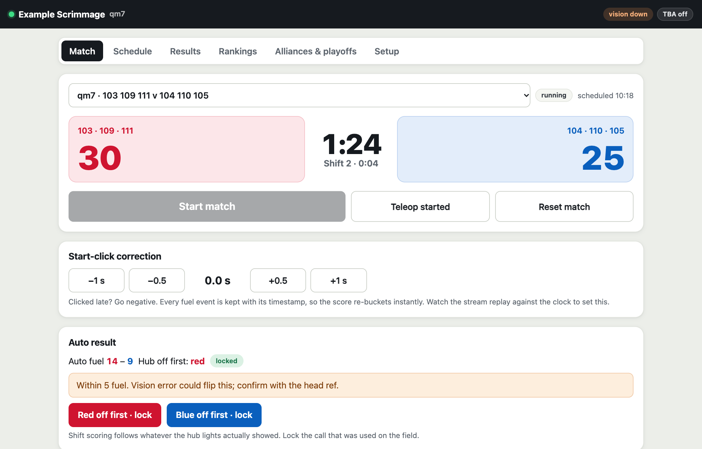
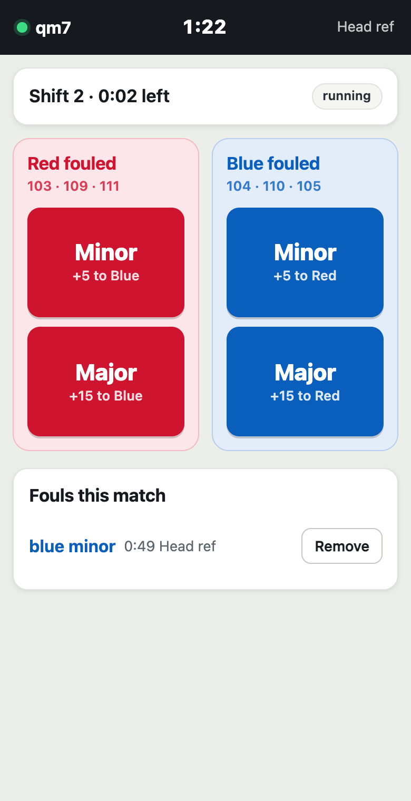
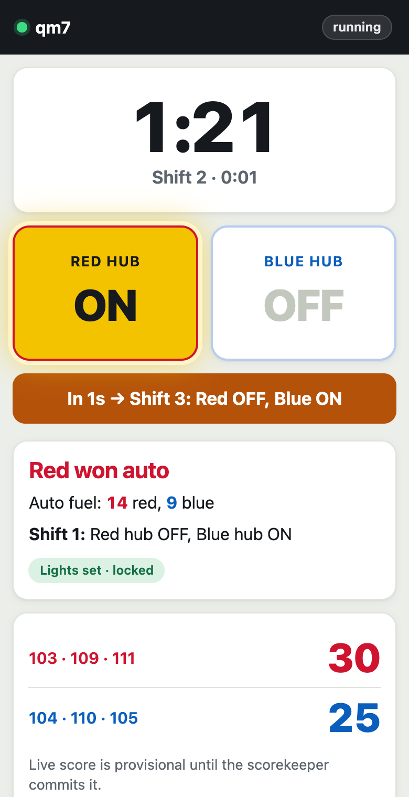
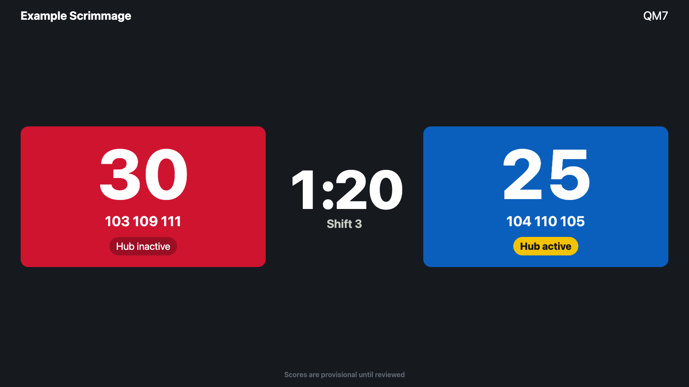
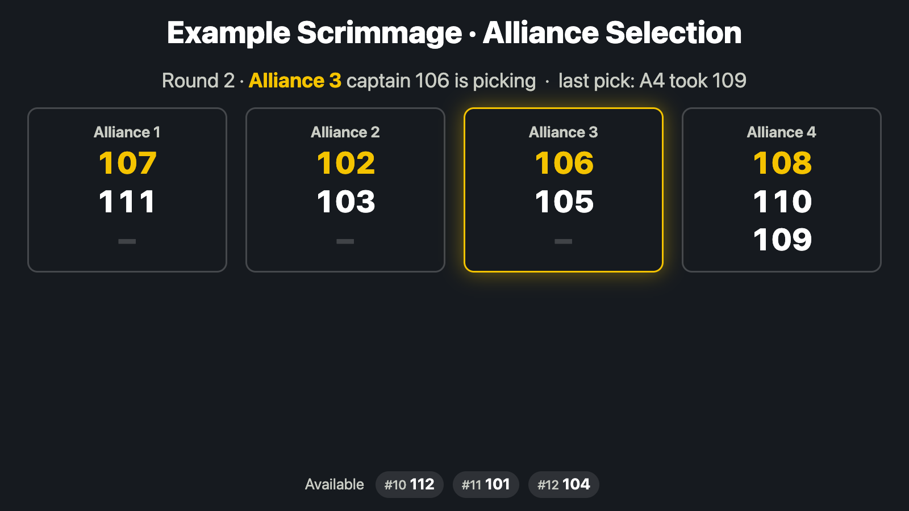

# Watchtower FMS: offseason field management with vision scoring

A free, open-source field management system for **FRC offseason events and scrimmages** playing the 2026 game **REBUILT**. It runs on one laptop on the venue WiFi:

- **Two hub cameras count fuel automatically** with a YOLO model you supply (no weights ship with this repo), or the scorekeeper types counts per period with no cameras at all.
- **Refs log fouls from their phones**, and the **emcee's phone says which hub lights to switch** and when.
- **The scorekeeper** runs matches, reviews and corrects scores, and runs **live alliance selection** that shows on the field display.
- **Quals schedule generator**, **rankings**, and a **4-alliance double-elimination playoff** with best-of-3 finals.
- **The Blue Alliance**: schedule, scores, rankings, alliances and match videos are pushed automatically, and queue up while the venue is offline.
- **Field display / OBS overlay** for the audience and the stream.

It doesn't control robots or talk to driver stations. It's the scoring, timing and event-management layer around a field you run by hand.

Built for the 10th Street Showdown (October 2026) and shared so other teams can run their own offseason events with it.

| Scorekeeper | Ref phone | Emcee phone |
|---|---|---|
|  |  |  |

| Field display | Live alliance selection |
|---|---|
|  |  |

---

## Quick start (no cameras, about 5 minutes)

```bash
git clone https://github.com/<owner>/watchtower-fms.git && cd watchtower-fms
python3 -m venv .venv && source .venv/bin/activate      # Windows: see Setup
pip install -r requirements.txt
python -m fms.init                     # creates config/event.yaml with random PINs (printed once)
```

Edit `config/event.yaml`: set `event.name`, `event.date` and `event.teams` (your team numbers). Then:

```bash
pip install -r vision/requirements.txt     # only needed for real cameras; skip for a first look
./run.sh ../config/vision.mock.yaml        # FMS + fake fuel; or: python -m fms.server
```

Open `http://localhost:8000` on the laptop, or `http://<laptop-ip>:8000` on a phone on the same WiFi. Pick **Scorekeeper**, log in with the control PIN, generate a schedule, and play a match. Everything below is detail.

---

## Contents

1. [Quick start](#quick-start-no-cameras-about-5-minutes)
1. [Architecture](#architecture)
2. [Repo layout](#repo-layout)
3. [Setup: macOS, Windows, Linux](#setup)
4. [Configuration](#configuration)
5. [Running](#running)
6. [Phones and networking](#phones-and-networking)
7. [Before the event: schedule](#before-the-event-schedule)
8. [Running a match](#running-a-match)
9. [Rankings, alliance selection, playoffs](#rankings-alliance-selection-playoffs)
10. [Vision: plugging in models](#vision-plugging-in-models)
11. [The Blue Alliance](#the-blue-alliance)
12. [Livestream and match videos](#livestream-and-match-videos)
13. [Data, backups, resetting](#data-backups-resetting)
14. [Testing](#testing)
15. [Working on this with AI agents](#working-on-this-with-ai-agents)
16. [Event-day checklist](#event-day-checklist)
17. [Troubleshooting](#troubleshooting)
18. [Limitations and things to verify](#limitations-and-things-to-verify)
19. [Contributing, license, credits](#contributing-license-credits)

---

## Architecture

Two independent processes. The FMS never touches the model, and vision never touches scoring rules.

```
 hub cam RED ──┐                                          ┌─ /ref      ref phones: fouls
               ├─ vision/run_vision.py ─(t, hub, n)──▶ FMS server ──┼─ /emcee    emcee phone: auto result, hub light cues
 hub cam BLUE ─┘   counter plugin + YOLO     HTTP      FastAPI    ├─ /control  scorekeeper laptop: start, review, commit
                                                     + SQLite   ├─ /display  field TV / OBS overlay
 stream cam ──▶ OBS ──▶ YouTube live                     │       └─▶ TBA outbox (retries until delivered)
```

**Vision only reports timestamped fuel events:** which hub, when, and how many. It knows nothing about periods, shifts or points.

**The FMS decides what each ball is worth.** It builds the match timeline from the scorekeeper's start click, then checks every fuel event against it: which period it fell in, whether that alliance's hub was active, and whether it landed inside the 3-second grace window after a hub shut off. That gives you three things:

- **Start-click error is fixable after the match.** Shift the timeline ±0.5 s and every ball re-buckets instantly.
- **Vision can be swapped, restarted or replaced** (new model, offline recount) without touching the FMS.
- **The FMS works with no vision at all.** The scorekeeper types fuel counts per period in review.

Everything lives in SQLite, so a crash or restart loses nothing. Phones get live state over one websocket and keep their own clock in sync with the server.

---

## Repo layout

```
fms/
  server.py        API, websocket, match engine (start, auto decision, review, commit)
  game.py          timeline + scoring: pure functions, all values from config
  schedule.py      qual schedule generator + CSV import
  bracket.py       4-alliance double elimination + rankings
  tba.py           TBA trusted API client with persistent outbox
  store.py         SQLite persistence
  config.py        config loader, defaults, PIN checks
  init.py          first-run setup: python -m fms.init
  static/          control / ref / emcee / display pages (vanilla JS, no CDN)
vision/
  run_vision.py    cameras -> counter -> FMS; records match video
  counters/        zone, linecross, mock, base interface
  rescore.py       recount a recorded match with a new model
  pick_roi.py      draw the hub region on a camera frame
  vconfig.py       vision config loader (takes vision_key from event.yaml)
  models/          put weights here (gitignored)
config/
  event.example.yaml   template: event, PINs, TBA, game rules (committed)
  vision.example.yaml  template: cameras, ROIs, counter, weights (committed)
  vision.mock.yaml     fake fuel for rehearsal (committed)
  event.yaml           your event; created by fms.init, gitignored
  vision.yaml          your cameras; created by fms.init, gitignored
docs/screenshots/  images used in this README
tests/             hand-computed scoring, schedule, bracket, selection, setup tests
run.sh             start FMS + vision together (runs fms.init on first use)
CLAUDE.md          project context for AI coding agents (AGENTS.md links to it)
LICENSE            MIT
```

---

## Setup

You need Python 3.12–3.14 and git. The FMS alone needs very little. The vision stack (PyTorch, Ultralytics, OpenCV) is about 1 GB.

### macOS (recommended; event laptop)

```bash
brew install python@3.12 git          # or use python.org Python 3.12–3.14
git clone https://github.com/<owner>/watchtower-fms.git
cd watchtower-fms
python3.12 -m venv .venv
source .venv/bin/activate
pip install -r requirements.txt -r vision/requirements.txt
chmod +x run.sh
python -m fms.init                    # creates config/event.yaml + config/vision.yaml, prints PINs
python -m pytest -q                   # expect: 16 passed
python -c "import torch, cv2, ultralytics; print(torch.__version__, torch.backends.mps.is_available())"
```

The last line should end in `True`, which means Apple Silicon GPU (MPS) inference is available. The first import can take up to a minute.

### Windows

```powershell
winget install Python.Python.3.12 Git.Git
git clone https://github.com/<owner>/watchtower-fms.git
cd watchtower-fms
py -3.12 -m venv .venv
.venv\Scripts\Activate.ps1            # if blocked: Set-ExecutionPolicy -Scope CurrentUser RemoteSigned
pip install -r requirements.txt -r vision\requirements.txt
python -m fms.init
python -m pytest -q
```

- `run.sh` is a bash script. Use two terminals instead (see [Running](#running)), or run it from Git Bash or WSL.
- NVIDIA GPU: install the CUDA build of PyTorch from pytorch.org *before* `vision/requirements.txt`. Otherwise inference runs on the CPU, which is too slow for two live cameras.
- Allow Python through Windows Defender Firewall on **Private** networks when prompted.

### Linux

```bash
sudo apt install python3 python3-venv git      # Debian/Ubuntu
git clone https://github.com/<owner>/watchtower-fms.git
cd watchtower-fms
python3 -m venv .venv
source .venv/bin/activate
pip install -r requirements.txt -r vision/requirements.txt
chmod +x run.sh
python -m fms.init
python -m pytest -q
```

- For camera access, add yourself to the `video` group: `sudo usermod -aG video $USER`, then log out and back in.
- For an NVIDIA GPU, install the matching CUDA PyTorch build first.
- If `ufw` is on: `sudo ufw allow 8000/tcp`.

### FMS only (no vision)

To try the pages or run scoring by hand, install just `requirements.txt` and skip `vision/requirements.txt`.

---

## Configuration

Your event's settings live in two gitignored files, so your PINs and event details never end up in git:

- `python -m fms.init` copies `config/event.example.yaml` → `config/event.yaml` and `config/vision.example.yaml` → `config/vision.yaml`. It fills in three random 6-digit PINs and a random vision key, and prints the PINs. It never overwrites an existing file. `run.sh` runs it automatically the first time.
- The server won't start if `config/event.yaml` is missing, a PIN is still `CHANGE-ME` or blank, or the control PIN is the same as the ref or emcee PIN.

### `config/event.yaml`

| Section | Key | What it does |
|---|---|---|
| `event` | `name`, `date`, `utc_offset_hours` | Display name; date and offset produce TBA match times (PDT = −7) |
| | `tba_event_key` | e.g. `2026xxxx`, from the TBA event URL |
| | `teams` | Team numbers at the event. At least 6 to build a schedule, at least 12 for live alliance selection (4 alliances of 3) |
| | `qual_start`, `cycle_min`, `lunch` | Schedule clock; the generator warns if quals run past lunch |
| `server` | `port` | Default 8000. Don't change it after phones have saved the pages |
| | `pins.control / ref / emcee` | Generated by `fms.init`. Give each one only to that role: anyone on the WiFi can load the pages |
| | `vision_key` | Shared secret between the FMS and vision. Vision reads it from this file, so you don't copy it anywhere |
| `tba` | `enabled` | Off while rehearsing (see [TBA](#the-blue-alliance)) |
| | `send_score_breakdown` | Off by default; totals-only is always accepted |
| `game` | all | Every timing and point value. **Verify against the manual** |

TBA credentials don't go in this file. See [The Blue Alliance](#the-blue-alliance).

### `config/vision.yaml`

| Key | What it does |
|---|---|
| `fms_url` | Where vision sends events (`http://127.0.0.1:8000` on the same laptop) |
| `vision_key` | Optional. Leave it out to use `server.vision_key` from `config/event.yaml` |
| `record_dir` | Raw hub video per match; `""` disables recording |
| `defaults.counter` | `zone`, `linecross`, `mock`, or `"module:Class"` |
| `defaults.weights` | Path to the model, e.g. `models/fuel_best.pt` |
| `hubs.red/blue.source` | Camera index (`0`, `1`), a video file path, or an `rtsp://` URL |
| `hubs.red/blue.roi` | `[x, y, w, h]` of the hub opening in full-resolution pixels |

Any key can be set under `defaults` or overridden per hub.

---

## Running

### One command (macOS / Linux)

```bash
source .venv/bin/activate
./run.sh                                     # real cameras (config/vision.yaml)
./run.sh ../config/vision.mock.yaml          # mock fuel: no model or cameras
./run.sh ../config/vision.yaml --preview     # camera windows with detections drawn
```

Ctrl+C stops both processes. On macOS, `run.sh` also keeps the laptop awake.

### Two terminals (event day, and Windows)

Two terminals let you restart vision, for example to swap models, without touching the FMS.

```bash
# terminal 1 (repo root)
source .venv/bin/activate          # Windows: .venv\Scripts\Activate.ps1
source tba_secrets.sh              # only if TBA is enabled (Windows: see TBA section)
caffeinate -dimsu python -m fms.server    # macOS; elsewhere just: python -m fms.server

# terminal 2
cd vision
source ../.venv/bin/activate
python run_vision.py --config ../config/vision.yaml --preview
```

In `--preview`, press `q` in a camera window to quit vision.

### Rehearse with no model

`./run.sh ../config/vision.mock.yaml` emits random fuel into both hubs. Everything else is real: refs, emcee, commits, rankings, playoffs. Use it to train volunteers before the model is ready.

---

## Phones and networking

Everyone joins the **venue WiFi**: the scorekeeper laptop, ref phones and the emcee phone. Phones open the laptop's address:

| OS | Find the laptop's IP |
|---|---|
| macOS | `ipconfig getifaddr en0` (try `en1` if blank) |
| Windows | `ipconfig` → "IPv4 Address" of the WiFi adapter |
| Linux | `hostname -I` |

Then on each phone, open `http://<ip>:8000/ref` (or `/emcee`) and choose Share → **Add to Home Screen**. It opens like an app.

- **`localhost` / `127.0.0.1` only works on the laptop itself.** On a phone it means the phone.
- **Type `http://` and `:8000`.** Some phone browsers try `https://` otherwise, and that fails.
- **The IP changes per network,** so recheck it at the venue. To get a name that never changes on macOS:
  ```bash
  sudo scutil --set LocalHostName watchtower-fms
  ```
  Then phones use `http://watchtower-fms.local:8000/ref`. iPhones resolve `.local` reliably, some Android phones don't, and some managed networks block it. Keep the IP as a backup.
- **Client isolation.** Some networks, especially guest ones, block phones from reaching the laptop. Test at the venue: if `http://<ip>:8000` loads on the laptop but not a phone, check the laptop firewall first. If it still fails, ask the venue for a non-guest network or to disable "client/AP isolation".
- **Phones must stay on WiFi.** Cellular can't reach a local IP. On iPhone, turn off Wi-Fi Assist (Settings → Cellular), and no VPNs.
- **Internet is only needed for TBA.** Scoring works fully offline, and TBA updates queue until internet returns.

PINs are in `config/event.yaml` (`fms.init` printed them). Changing one there takes effect on the next server restart; phones then ask for the new PIN.

---

## Before the event: schedule

Open `/control` → **Schedule**.

**Generate:**
1. The page suggests matches per team from your team count, start time, cycle time and lunch.
2. Click **Generate**. It searches for about 4 s and shows a preview with stats: back-to-backs, max partner and opponent repeats, and when quals end.
3. Click **Save this schedule.**

Seed is optional; the same seed gives the same schedule.

**Import instead:** paste CSV lines `match,red1,red2,red3,blue1,blue2,blue3[,HH:MM]`. Mark a surrogate with `*`, e.g. `254*`.

**Surrogates:** if `teams × matches per team` isn't divisible by 6, some teams play one extra match as a surrogate. Surrogate matches don't count in their rankings.

**Back-to-backs:** with 12 teams and 6-team matches, some teams will play two matches in a row. Avoiding that entirely would mean the same two groups of 6 alternate all day. The generator minimizes them. Plan queueing and battery swaps around the ones it shows.

**Push to TBA:** click **Send schedule to TBA**. This sends the team list and all matches as unplayed.

The schedule locks once any qual match has started.

---

## Running a match

### Scorekeeper (`/control` → Match)

1. **Select** the match. It auto-advances to the next one after each commit.
2. **Start match** exactly on the field countdown.
   - Clicked late? After the match, use **−0.5 s / −1 s** (negative = real start was earlier). The score re-buckets instantly.
   - **Teleop started** (optional): click it if the field's teleop start drifted from the default 3 s pause.
3. **Auto result:** the FMS decides it 3 s after auto ends (the grace window).
   - The alliance with **more auto fuel has its hub OFF in Shift 1.** A tie is a coin flip.
   - If the margin is within `close_auto_margin` (5), you get a warning. Get the head ref's call.
   - **Red off first / Blue off first** overrides the result and locks it.
4. The match goes to **review** automatically when it ends: 2:43 of match time plus 3 s grace.

### Emcee (`/emcee`)

- Shows the big match clock and both hub tiles, which glow when that hub is active.
- After auto, it shows who won, the auto counts, and the light plan: "Shift 1: Blue OFF, Red ON".
- **Lights set** locks the call. Shift scoring follows the locked call, because that's what robots actually played to.
- Before every hub change it counts down ("In 7s → Shift 2: Red ON, Blue OFF"). It turns amber at 5 s and vibrates at 3 s on Android.

### Refs (`/ref`)

- Enter your PIN and name once.
- The big buttons are **Red fouled: Minor / Major** and **Blue fouled: Minor / Major**. Points go to the *other* alliance (minor 5, major 15 by default).
- After a tap you can tag the team that fouled, or skip.
- Refs can remove their own entries until the match is committed. The scorekeeper can remove any.

### Review and commit (`/control`)

| Area | What to do |
|---|---|
| **Fuel table** | Vision count per period. Type the real count in **final** to override. Vision data is never deleted |
| **Inactive-hub fuel seen** | Balls that went into a hub while it was off (worth 0). Useful for spotting a wrong auto call |
| **Tower** | Per robot: **L1 in auto** checkbox and end level (none / L1 / L2 / L3) |
| **Fouls** | Everything refs logged. Remove mistakes, or add your own |
| **Summary** | Fuel, auto, teleop, tower, penalty points, total, bonus RP, RP |
| **Video** | Auto-suggested from the livestream, or paste a YouTube ID |
| **Commit and send to TBA** | Locks the match; pushes the match, rankings and video; advances to the next match |

- **Reopen for edits** unlocks a committed match. Recommitting re-sends it to TBA.
- **Reset match** (before commit) clears timing, adjustments and climbs so the match can be replayed. You're asked whether to delete its fouls.

### Field display (`/display`)

Full-screen scoreboard for a TV, or add it as a **Browser Source** in OBS for the stream overlay. It shows live provisional scores, the clock, and hub-active indicators, then the final breakdown with the winner after commit. No PIN.

### Scoring rules as implemented

- Auto 20 s → 3 s pause → Transition 10 s → Shifts 1–4, 25 s each, hubs alternating → Endgame 30 s. Teleop is 140 s.
- 1 point per fuel in an active hub. Fuel within 3 s after a hub turns off still counts.
- Auto L1 climb: 15. Teleop climb: L1 10, L2 20, L3 30. Minor foul: 5. Major foul: 15. All configurable.
- RP: win 3, tie 1, plus Energized (≥100 fuel), Supercharged (≥360 fuel), Traversal (≥50 tower points).

---

## Rankings, alliance selection, playoffs

**Rankings** (`/control` → Rankings):
- Recomputed on every committed qual and queued to TBA automatically. **Push rankings to TBA** forces it.
- Sort order: ranking score (average RP), then average match score, average tower, average fuel, team number.

**Live alliance selection** (`/control` → Alliances & playoffs):
- **Start alliance selection** freezes the current rankings. The top 4 become captains, and `/display` switches to a selection screen showing the alliances, who's picking, and the teams still available.
- Click a team to record the pick. Round 1 goes A1→A4 and round 2 goes A4→A1. In round 1 a captain who hasn't picked yet can be invited: confirm they accepted, lower alliances move up, and the next-ranked team becomes the new A4 captain.
- **Undo last pick** and **Cancel selection** are there for mistakes. Declines aren't tracked: if a team declines, just wait for the next pick.
- After the last pick, **Save alliances and build bracket** sends the alliances to TBA and creates the first two playoff matches. The display keeps showing the final alliances until you switch it back or start a match.
- The button at the top of the panel toggles the field display between the selection screen and the match screen.

**Manual alliance entry** (same tab): pick Captain, Pick 1 and Pick 2 for A1–A4 from dropdowns in rank order. Use it to skip live selection or fix a mistake. Alliances can be changed until the first playoff match starts.

**Bracket:** 4-alliance double elimination, then best-of-3 finals. Matches appear as results come in.

| Match | Red vs Blue |
|---|---|
| sf1m1 | A1 vs A4 (upper) |
| sf2m1 | A2 vs A3 (upper) |
| sf3m1 | losers of sf1 and sf2 (lower; loser is out) |
| sf4m1 | winners of sf1 and sf2 (upper final) |
| sf5m1 | loser of sf4 vs winner of sf3 (lower final; loser is out) |
| f1m1–f1m3 | winner of sf4 vs winner of sf5, first to 2 wins |

The better seed is red, except in the finals, where the upper-bracket winner is red.

**Playoff ties can't be committed.** Pick who advances using your tiebreaker, or reset and replay.

---

## Vision: plugging in models

### Contract

A counter receives frames from one hub camera and returns how many **new** balls it counted in that frame:

```python
class MyCounter(Counter):            # vision/counters/base.py
    def process(self, frame, t) -> int: ...
    def draw(self, frame): ...       # optional, for --preview
```

Vision timestamps each count and batches it to the FMS 4× per second. If the FMS is unreachable, events buffer and re-send.

### Swap in a model

1. Copy weights to `vision/models/` (e.g. `fuel_best.pt`; `.pt` files are gitignored, so share them separately).
2. Set `weights:` in `config/vision.yaml`.
3. Restart **only** the vision process. The FMS keeps running and loses only the seconds vision was down.

Inference runs on MPS (Apple Silicon), CUDA, or CPU, whichever is available.

### Set the hub region (ROI)

```bash
cd vision
python pick_roi.py 0          # camera index, or: python pick_roi.py frame.png
```

Drag a box over the hub opening and press Enter. It prints `roi: [x, y, w, h]` in full-resolution pixels (Retina-safe). Paste that into the hub's entry in `config/vision.yaml`. Re-pick it if a camera gets bumped.

### Counters

| Counter | How it counts | Use when |
|---|---|---|
| `zone` (default) | Runs the model on a crop around the ROI; links detections frame-to-frame with a small nearest-neighbor tracker; counts each short track once | Wide or noisy views. Built because ByteTrack fragmented badly on broadcast footage |
| `linecross` | Ultralytics ByteTrack; counts IDs crossing a line inside the ROI moving down | Close cameras with clean, continuous ball tracks |
| `mock` | Random fuel at `rate_per_s`, no model or camera (`source: none`) | Rehearsals, UI testing |
| `"pkg.module:Class"` | Your own | Anything else |

`zone` tuning keys:

| Key | Default | Meaning |
|---|---|---|
| `conf` | 0.25 | Detection confidence |
| `imgsz` | 640 | Inference size on the crop; use 960 if balls are under ~20 px |
| `crop_pad` | 60 | Pixels of padding around the ROI |
| `max_px` | 60 | Max movement between frames to count as the same ball |
| `min_hits` | 2 | Frames a track must be seen before it counts (kills one-frame noise) |
| `max_missed` | 3 | Frames a ball may vanish and keep its identity |
| `min_dy` | 0 | Required downward travel before counting (0 = off) |

### Recording and rescoring

While a match runs, vision records each hub to `vision/recordings/<match>_<id>_<hub>.mp4`, with per-frame timestamps in a matching `.csv`.

With a better model later, recount a match:

```bash
cd vision
python rescore.py --match qm7 --hub red --video recordings/qm7_<id>_red.mp4 --weights models/v2.pt --dry-run
python rescore.py --match qm7 --hub red --video recordings/qm7_<id>_red.mp4 --weights models/v2.pt
```

- `--dry-run` only prints the count.
- Without it, that hub's fuel for the match is replaced in the FMS, on the same clock. The match must be in review, so **Reopen** it first if it's committed.

These recordings are also your best training data, because they come from the real camera mount.

### Camera tips

- Put each camera on its own USB port or controller. Two 1080p streams can saturate one hub.
- Lock exposure and focus if the camera allows it, since auto-exposure changes under arena lights.
- Mount cameras rigidly. The ROI is in pixels.
- If vision and the FMS run on different machines, both clocks must be NTP-synced.

---

## The Blue Alliance

### Getting access

1. Your offseason event must exist on TBA.
2. Request **write (Trusted API) access** for that event from TBA. Approval can take days, so do it early.
3. Once approved, you get an **Auth ID** and **Auth Secret** for the event. A single "read key" from your account page is not a write key.

### Configure

In `config/event.yaml`:

```yaml
event:
  tba_event_key: "2026xxxx"
tba:
  enabled: true
```

Keep the secrets out of git. `tba_secrets.sh` is already gitignored:

```bash
cat > tba_secrets.sh <<'EOF'
export TBA_AUTH_ID="..."
export TBA_AUTH_SECRET="..."
EOF
source tba_secrets.sh             # run.sh does this for you if the file exists
```

On Windows PowerShell, set them in the server's terminal instead: `$env:TBA_AUTH_ID="..."` and `$env:TBA_AUTH_SECRET="..."`.

On TBA's side, set the event's playoff type to **4-alliance double elimination**.

### Test safely

1. Before any schedule exists, click **Send schedule to TBA**. Only the team list goes.
2. Confirm the teams appear on the TBA event page.
3. `HTTP 401` in Setup means the ID, secret or event key is wrong.

### What gets sent

| Trigger | Endpoint |
|---|---|
| Send schedule | `team_list/update`, `matches/update` (unplayed, score −1) |
| Commit match | `matches/update`, `rankings/update` (quals), `match_videos/add` (if a video is set) |
| Save alliances | `alliance_selections/update`, plus the new playoff matches |
| Webcast URL | `info/update` |
| Push everything | All of the above, resent |
| Off TBA (Schedule → All matches) | `matches/delete` for that match, then `rankings/update` |
| Take all matches and rankings off TBA (Setup) | `matches/delete_all`, then empty `rankings/update` |

Takedowns only touch TBA; local data is kept. Anything pushed again later (a commit, **Send schedule**, **Push everything**) puts it back. Let takedowns finish sending before **Wipe everything**, since a wipe clears the outbox.

### Outbox

- Every write goes into SQLite first, then a background sender delivers it.
- **Network errors retry forever.** Offline at the venue is fine.
- **4xx rejections** become "failed" after 3 tries and show in Setup, where **Retry failed** re-queues them.
- Superseded writes are collapsed, so only the newest rankings are sent.
- The header pill shows queued and failed counts.

### Warning: rehearsals

With `enabled: true`, every committed match goes to the real event page, including mock-vision scores. Rehearse with `enabled: false`. Before the event, wipe practice data (see [Data, backups, resetting](#data-backups-resetting)).

---

## Livestream and match videos

TBA doesn't host video. Match videos are links into your YouTube livestream at the right timestamp, so nothing needs uploading.

1. Stream the third camera with OBS to YouTube. Add `/display` as a Browser Source for the score overlay.
2. In `/control` → Setup, enter the livestream's **YouTube video ID** and click **Save**.
3. Click **Stream went live now** the moment OBS goes live.
4. Every committed match gets `<videoID>?t=<seconds>`, starting 10 s before auto. You can override it per match in review.
5. Optional: enter the stream URL under **Send to TBA** so it shows as the event webcast.

Test this on one match early, and check the timestamp lands where you expect.

---

## Data, backups, resetting

- All state lives in `data/fms.sqlite3`: matches, fuel events, fouls, the TBA outbox and settings. It's gitignored.
- **Past matches:** `/control` → Results lists every played match. Click one for its full breakdown: per-period fuel (with the vision count where it was overridden), tower, fouls, RP and video. Viewing doesn't change the current match or the field display. **Open in Match tab** brings it up for editing or reopening.
- **Results CSV:** `/control` → Schedule → **Download results CSV**, which has per-period fuel, tower, fouls and RP for every match. Grab one at lunch and at the end of the day.
- **Backup:** copy `data/fms.sqlite3` while the server is stopped.
- **Wipe from the UI:** `/control` → Setup → Wipe data asks for the scorekeeper PIN again and refuses while a match is running. It always saves a copy to `data/backups/` first.
  - **Wipe playoffs** removes alliances, the live selection and every playoff match (and their fouls and unsent TBA writes). Quals are kept.
  - **Wipe everything** removes the schedule, results, fuel, fouls, the TBA queue and settings like the webcast. Logins stay valid.
  - Neither one deletes anything already sent to TBA.
- **Fresh start** (after rehearsals): use Wipe everything, or stop the server and run `rm data/fms.sqlite3*`.

---

## Testing

```bash
python -m pytest -q
```

The tests cover the timeline, grace-window attribution, the auto decision, full match scores (hand-computed), manual adjustments, playoff ties, schedule balance and surrogates, the full double-elimination bracket, live alliance selection (serpentine order, captain promotion, illegal picks), and rankings. `game.score_match` also checks at runtime that two independent totals agree.

For an end-to-end check, run `./run.sh ../config/vision.mock.yaml` and play a match on `/control`.

---

## Working on this with AI agents

- **`CLAUDE.md`** holds the project context Claude Code reads every session: architecture, invariants, game values, constraints, and what's not built yet.
- **`AGENTS.md`** is a link to it, for Codex and other agents.
- Edit only `CLAUDE.md`.
- The rule: scoring math lives only in `fms/game.py`, and `python -m pytest -q` must pass after every change.
- When a change affects setup or usage, update this README in the same commit.

---

## Event-day checklist

**The week before**
- [ ] Every `game:` value checked against the 2026 manual
- [ ] TBA write access approved; team list test passed
- [ ] `config/event.yaml` has your event name, date, teams and TBA key; PINs shared only with their roles
- [ ] Full rehearsal with refs and emcee on phones, using mock vision
- [ ] Model weights tested on recorded footage

**At the venue**
- [ ] Laptop plugged in, on venue WiFi
- [ ] Laptop IP noted (or `.local` name confirmed)
- [ ] One phone loads `/ref` (proves there's no client isolation)
- [ ] Both hub cameras mounted; ROIs re-picked with `pick_roi.py`
- [ ] Vision pill green in `/control`
- [ ] `rm data/fms.sqlite3*` done, `tba.enabled: true`, `source tba_secrets.sh`
- [ ] Server started; schedule generated, saved and sent to TBA
- [ ] OBS live → **Stream went live now** clicked
- [ ] Refs and emcee have the pages on their home screens

**During**
- Start on the countdown; fix the offset in review if needed.
- Emcee locks the auto call every match.
- Review climbs and fouls before every commit.
- Download the results CSV at lunch.

---

## Troubleshooting

| Symptom | Fix |
|---|---|
| Phone can't load the page | Use the laptop IP, not localhost; include `http://` and `:8000`; same WiFi, not cellular; allow Python through the firewall; test for client isolation ([Phones and networking](#phones-and-networking)) |
| `address already in use` | An old server is still running: `lsof -ti :8000 \| xargs kill` (macOS/Linux) |
| "Log in again" on a phone | Wrong PIN, or the PIN changed; reload and re-enter |
| Vision pill red / "silent" | Vision process not running, wrong `fms_url`, or `vision_key` mismatch |
| "camera read failed" | Wrong camera index, camera used by another app (e.g. OBS), or unplugged |
| Counts way too high | Raise `min_hits` or `conf`, tighten the ROI, lower `max_px` |
| Counts too low | Lower `conf`, raise `imgsz` to 960, raise `max_missed`, check the ROI covers the opening |
| TBA "failed" with 401 | Wrong auth ID, secret or event key; secrets not sourced in the server terminal |
| TBA "failed" with 400 | TBA rejected the data, e.g. a team not registered on the event; fix, then **Retry failed** |
| Can't commit a playoff match | It's tied; pick who advances or reset |
| Start button disabled | Match isn't `scheduled`; reset it, or select the next match |
| `permission denied: ./run.sh` | `chmod +x run.sh` |
| `config/event.yaml not found` | Run `python -m fms.init` from the repo root |
| `Set server.pins ...` or `control PIN ... must differ` | Edit the PINs in `config/event.yaml`; each role needs its own, and `CHANGE-ME` isn't allowed |
| "Add at least 6 team numbers" when generating | Fill in `event.teams` in `config/event.yaml` and restart the server |
| "Need at least 12 teams" starting alliance selection | Live selection needs 4 full alliances; use manual alliance entry for smaller events |

---

## Limitations and things to verify

**Verify before the event**
- Every value under `game:`. Sources disagreed on teleop Level 1 (10 vs 15).
- RP thresholds and foul values.
- TBA accepting `?t=` timestamps on match videos (test one).
- TBA playoff type for the 4-alliance bracket.

**Built for one shape of event**
- The 2026 game, REBUILT. Scoring lives in `fms/game.py` and the values in `config/event.yaml`; another season means new scoring code.
- Exactly 4 alliances in a double-elimination bracket with best-of-3 finals. Live selection needs at least 12 teams. With fewer, enter alliances by hand (at least captain + 1 pick each).
- One laptop runs everything. Pages are plain `http://` on the local network, protected only by PINs, so use a venue network you trust.

**Not implemented**
- Yellow and red cards, DQs, playoff backup robots.
- FRC's exact ranking and playoff tiebreakers. Rankings use the sort described above; playoff ties are decided by the scorekeeper.
- TBA `score_breakdown`: off by default, because TBA validates per-season keys.
- Automatic robot enable/disable. This system doesn't talk to driver stations.

---

## Contributing, license, credits

- **Bugs and ideas:** open a GitHub issue. Logs from the server terminal and a screenshot of `/control` → Setup help a lot.
- **Pull requests:** keep scoring math in `fms/game.py`, add a hand-computed test for any scoring or timeline change, and make sure `python -m pytest -q` passes. Update this README in the same PR when setup or usage changes. `CLAUDE.md` lists the invariants.
- **License:** MIT (see `LICENSE`). Use it, change it, and run your own events with it.
- **Credits:** built for the 10th Street Showdown offseason event, October 2026.
